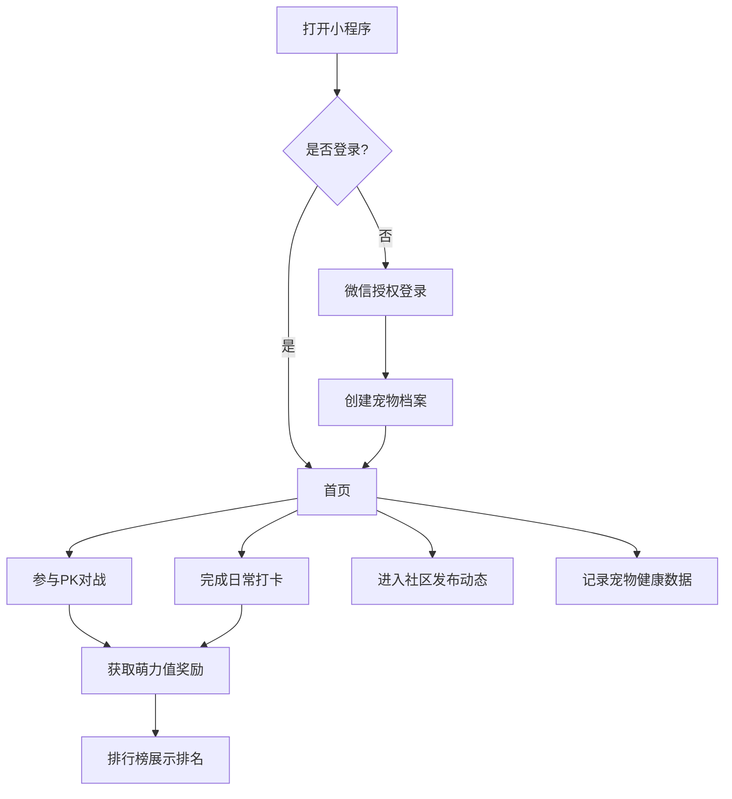

## 1. 产品概述
这是一款名为“萌宠PK”的微信小程序，旨在为宠物爱好者提供一个集宠物展示、互动打榜、健康管理与社区交流于一体的平台。
- 主要解决宠物主记录宠物成长、展示宠物魅力以及与其他宠物主交流的需求，提升养宠乐趣。
- 目标受众：喜爱分享、追求互动、关注宠物健康的宠物主及云养宠人群。

## 2. 核心功能

### 2.1 用户角色
| 角色 | 注册方式 | 核心权限 |
|------|----------|----------|
| 访客 | 无 | 浏览社区帖子、查看公开排行榜 |
| 登录用户 | 微信一键登录 | 参与宠物PK、打卡互动、记录宠物健康数据、发布社区动态 |

### 2.2 功能模块
1. **首页（PK与打卡）**：宠物PK匹配、AI颜值评分展示、日常打卡互动。
2. **排行榜**：全国榜单、城市榜单切换展示。
3. **社区交流**：图文动态发布、点赞评论互动。
4. **宠物健康追踪**：体重数据录入、健康图表（折线图）展示。
5. **我的（个人中心）**：微信登录、多宠物档案管理、萌力值资产展示。

### 2.3 页面详情
| 页面名称 | 模块名称 | 功能描述 |
|----------|----------|----------|
| 首页 | 宠物PK区 | 点击匹配进行双宠PK，通过AI颜值、萌力值和活跃度综合判定胜负 |
| 首页 | 日常互动区 | 每日打卡、喂食/抚摸等模拟互动，增加萌力值 |
| 排行榜页 | 榜单展示 | 支持全国榜单、城市同城榜单切换，展示排名、宠物头像、分数 |
| 社区页 | 动态信息流 | 瀑布流/列表展示用户发布的宠物照片和动态，支持点赞、评论 |
| 健康追踪页 | 体重记录与图表 | 表单录入宠物体重记录，通过图表渲染折线图趋势 |
| 我的页 | 个人信息与档案 | 微信授权登录，展示当前萌力值；管理多个宠物档案（新增/编辑） |

## 3. 核心流程
用户核心操作流程：授权登录 -> 创建宠物档案 -> 参与打卡与PK -> 浏览社区与排行榜。

## 4. 用户界面设计
### 4.1 设计风格
- **主色调**：明快活泼的色彩（如温暖的橙黄色、治愈的薄荷绿）。
- **按钮风格**：大圆角、微渐变加轻盈阴影，具有Q弹感。
- **字体**：圆润无衬线体，大字号标题，突出数据（如萌力值）。
- **布局风格**：卡片式布局，增加留白，突出宠物图片。
- **图标/表情**：使用大量可爱的宠物爪印、骨头、鱼干等主题图标。

### 4.2 页面设计概览
| 页面名称 | 模块名称 | UI元素 |
|----------|----------|--------|
| 首页 | PK对战卡片 | 动态微动效的宠物卡片对撞设计，强调视觉冲击力 |
| 社区页 | 瀑布流列表 | 响应式双列图片流，悬浮点赞按钮 |
| 健康追踪页 | 数据图表 | 平滑渐变折线图，底部带有记录按钮 |
| 我的页 | 档案轮播卡 | 横向滑动切换多只宠物卡片，色彩鲜明区分不同宠物 |

### 4.3 响应式设计
- 优先适配手机端竖屏浏览体验。
- 考虑到不同屏幕尺寸（如刘海屏、全面屏）的安全区适配（SafeArea）。