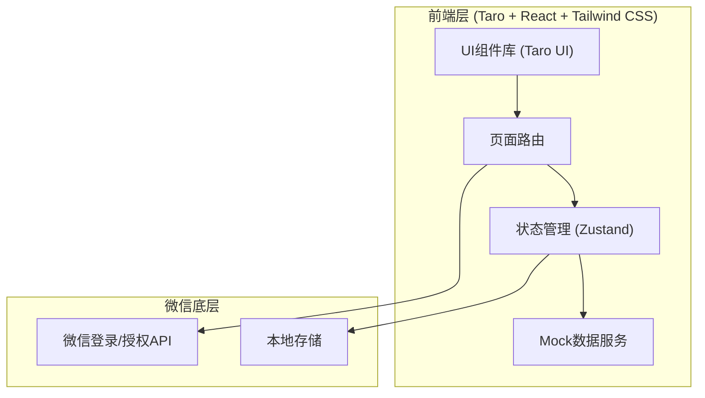
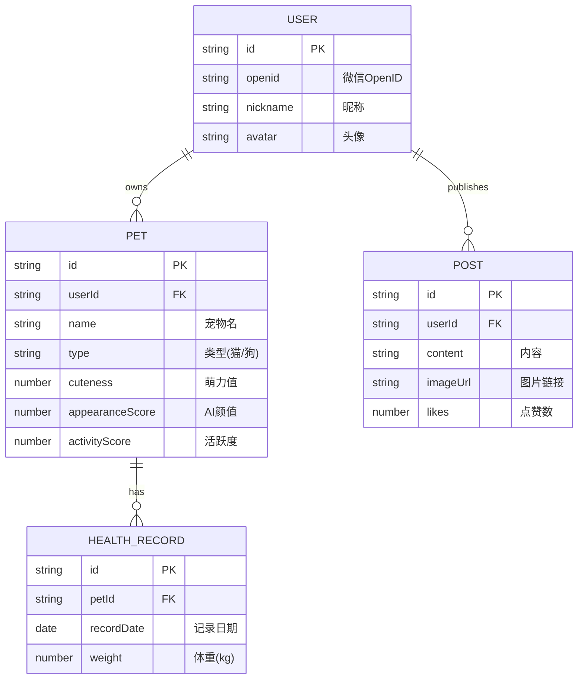

## 1. 架构设计


## 2. 技术栈说明
- **前端框架**：Taro@3 + React@18 (跨端框架，编译到微信小程序)
- **UI 组件库**：Taro UI 
- **样式方案**：CSS Modules / Tailwind CSS (通过 weapp-tailwindcss)
- **图表库**：Echarts-for-weixin (用于体重折线图)
- **状态管理**：Zustand
- **数据来源**：全部使用前端 Mock 数据（Promise模拟异步请求）

## 3. 路由定义
| 路由路径 | 用途 |
|----------|------|
| `/pages/index/index` | 首页（包含PK功能、日常打卡互动） |
| `/pages/rank/index` | 排行榜页（全国/城市榜） |
| `/pages/community/index` | 社区交流页（动态列表） |
| `/pages/health/index` | 宠物健康追踪页（体重图表） |
| `/pages/user/index` | 我的主页（登录、宠物档案展示） |

## 4. API 定义 (Mock接口预留)
```typescript
// 统一响应格式
interface ApiResponse<T> {
  code: number;
  data: T;
  message: string;
}

// 1. 获取宠物信息
interface GetPetsResponse {
  id: string;
  name: string;
  avatar: string;
  breed: string;
  cuteness: number; // 萌力值
}

// 2. 发起PK
interface PKRequest {
  myPetId: string;
}
interface PKResponse {
  winnerId: string;
  scoreDetails: {
    appearance: number; // AI颜值分数 (40%)
    cuteness: number;   // 萌力值 (40%)
    activity: number;   // 社区活跃度 (20%)
  };
  rewardCuteness: number;
}

// 3. 健康数据录入与查询
interface HealthRecord {
  date: string;
  weight: number;
}
```

## 5. 服务端架构图
*本项目目前为纯前端Mock开发，暂无实际服务端交互，预留标准RESTful请求封装层。*

## 6. 数据模型
### 6.1 数据模型定义
