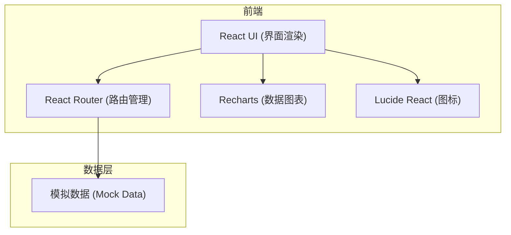
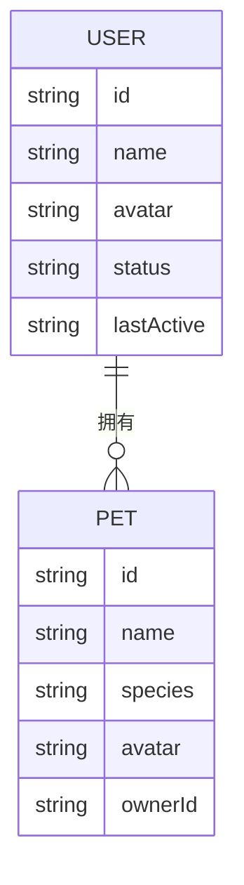

## 1. 架构设计

## 2. 技术说明
- 前端：React@18 + tailwindcss@3 + vite
- 初始化工具：vite-init
- 样式组件：使用 Tailwind CSS 进行原子化样式开发
- 图表库：Recharts（用于数据仪表盘展示）
- 图标库：lucide-react

## 3. 路由定义
| 路由 | 用途 |
|-------|---------|
| / | 数据仪表盘（首页），展示活跃用户等核心指标 |
| /users | 用户管理，展示所有用户列表及其活跃状态 |
| /pets | 宠物管理，展示所有宠物及其主人信息 |

## 4. API 定义 (模拟数据结构)
由于未指定后端，前端将使用模拟数据。
- `User`: `{ id, name, avatar, status: 'active' | 'offline', lastActive, pets: Pet[] }`
- `Pet`: `{ id, name, species, avatar, ownerId }`

## 5. 数据模型
### 5.1 数据模型定义
