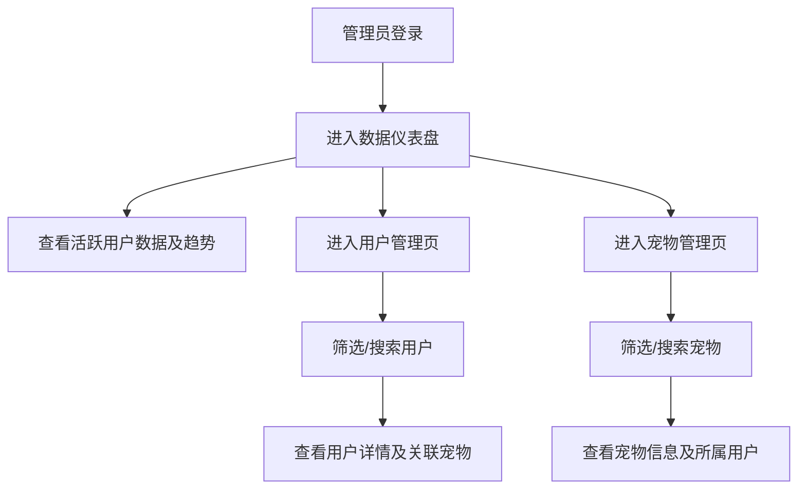

## 1. 产品概述
用于管理“萌宠PK”小程序的后台管理系统。
- 主要用于查看活跃用户数据，管理所有用户及其对应的宠物信息。
- 为运营团队提供数据支持和用户管理能力，提升小程序的用户体验和活跃度。

## 2. 核心功能

### 2.1 用户角色
| 角色 | 注册方式 | 核心权限 |
|------|----------|----------|
| 管理员 | 后台账号分配 | 浏览活跃用户数据、管理用户与宠物信息 |

### 2.2 功能模块
1. **数据仪表盘**：关键数据概览（活跃用户数、宠物总数等）、数据趋势图
2. **用户管理页**：用户列表、用户详情、活跃状态查看
3. **宠物管理页**：所有宠物信息列表、宠物所属用户查看

### 2.3 页面详情
| 页面名称 | 模块名称 | 功能描述 |
|----------|----------|----------|
| 数据仪表盘 | 关键指标 | 展示今日活跃、总用户、总宠物数等核心数据 |
| 数据仪表盘 | 活跃趋势 | 以图表形式展示近期活跃用户变化趋势 |
| 用户管理页 | 用户列表 | 分页展示所有用户，支持按活跃状态筛选、搜索 |
| 用户管理页 | 用户详情 | 查看单个用户的基本信息及关联宠物列表 |
| 宠物管理页 | 宠物列表 | 分页展示所有宠物，支持按种类、名字搜索，并显示主人信息 |

## 3. 核心流程
管理员登录系统后，可以直观地查看活跃用户趋势。在用户管理页面可以检索特定用户并查看其宠物信息；在宠物管理页面可以总览所有宠物并反查对应的用户信息。

## 4. 用户界面设计
### 4.1 设计风格
- 主色调和辅色调：采用清新明快的宠物主题色（如温暖的橙色或清新的薄荷绿），搭配专业的后台深灰/亮白。
- 按钮风格：圆角（Rounded），现代化微投影。
- 字体和大小：使用现代化无衬线字体，保证数据展示清晰。
- 布局风格：经典的顶部导航 + 侧边栏布局（侧边栏卡片化）。
- 图标风格：使用现代化线框图标（如 Lucide Icons），风格统一。

### 4.2 页面设计概述
| 页面名称 | 模块名称 | UI元素 |
|----------|----------|--------|
| 数据仪表盘 | 关键指标 | 渐变背景卡片，大字号数字突出，带趋势箭头 |
| 数据仪表盘 | 活跃趋势 | 折线图/柱状图展示，配色清爽 |
| 用户管理页 | 用户列表 | 现代化数据表格，带头像、状态标签（如“活跃”、“离线”） |
| 宠物管理页 | 宠物列表 | 图片卡片或表格形式，展示宠物头像、品种及主人标识 |

### 4.3 响应式
桌面端优先，适配大屏和平板设备，以PC端后台管理体验为主。